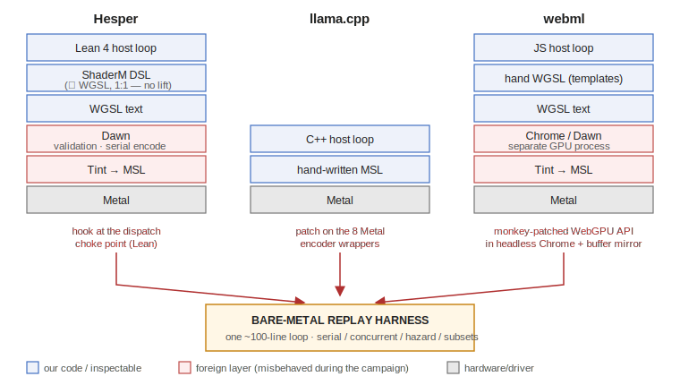
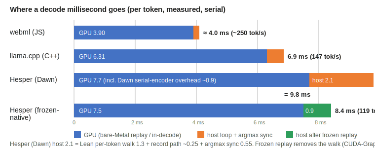

# Where the Milliseconds Go: a Measured Anatomy of LLM Decode on Apple Silicon across Three Engines

*Verilean / Hesper post-mortem technical report — 2026-07-06.*
*All measurements: M4 Max (546 GB/s peak DRAM BW), gemma-4-E2B-it, greedy decode.*
*Methods and raw logs: `DEVPLAN.md` §8–§13, `DEVLOG.md`, `tools/replay/README.md`.*

## Abstract

**Background.** Hesper is an LLM inference engine written in Lean 4 that generates
WGSL compute kernels, built on two motivations: *verified inference* (typed
quantization layouts and proof-carrying kernels — bug classes like out-of-bounds
writes and aliasing eliminated by construction) and *browser distribution* via
WebGPU. The design added layers — Lean DSL → WGSL → Dawn → Tint → Metal — and this
report is a case study of what those layers actually cost, in a setting where we can
measure it cleanly.

**The unusual property of this case: the layers' runtime overhead is nearly zero.**
The DSL maps 1:1 to WGSL (no abstraction lift, no semantic gap); kernel structures
port faithfully through it (a llama.cpp kernel port reached 90–97 % of isolated
bandwidth); and by capturing one decode token from each of three engines — ours,
llama.cpp, and the hand-written webml — and replaying all three on a single
bare-Metal harness, we show that transport, scheduling, op count, and host runtime
each measure at ≲0.7 ms/token. Kernels plus the op graph set the floor; every mature
runtime is a rounding term.

**And yet the stack lost — which localizes the real cost.** The same author (the
Fable 5 model) wrote webml's kernels in ~30 minutes on a seconds-turnaround stack,
and could not reach parity in days inside ours. Concretely, on Gemma-4-E2B a decoded
token costs **8.4 ms on our best path vs 6.8 ms (llama.cpp) vs ~4.0 ms (webml)** — a
256-token reply in ~2.2 s vs ~1.7 s vs ~1.0 s; on DiffusionGemma, one diffusion step
costs **780–880 ms on ours vs 363 ms on llama.cpp** after a multi-day campaign. With execution overhead
eliminated as the explanation by measurement, what remains is **iteration time**:
structural kernel changes — the only kind that mattered — pay a minutes-long compile
loop, while the thin stack pays seconds. The abstraction tax is turnaround time, not
microseconds. §7 turns this into requirements for the next tool: explore at JIT
cadence with kernels-as-data; verify the frozen trace afterwards.

## Key findings at a glance

- **Kernels + graph set the floor; the runtime is a ±0.5 ms rounding term.** Host
  loops measured: webml (JS!) ~0.2 ms, llama.cpp ~0.55 ms, Hesper 2.5 ms → 0.9 ms
  after a CUDA-Graphs-style frozen replay.
- **Concurrency is irrelevant for batch-size-1 decoding — in every engine.** Decode dataflows
  are ~86–96 % true dependencies; llama.cpp's own toggles price its entire scheduling
  apparatus at ≲0.6 ms. Racy no-barrier replays that suggest 2× are a mirage.
- **webml's 1.7× lead over llama.cpp is kernel craft** (fat epilogue-fused kernels,
  int4 + int8 activations), not model format (~10–15 % of bytes) or runtime.
- **Isolated kernel benchmarks flatter bandwidth by 13–26 %** (warm-cache artifact);
  the deficit that remains is a function of op *size*, unreachable by parameter tuning.
- **Same author, two stacks: ~30 minutes vs days.** The DSL added no abstraction lift
  over WGSL — only layers, and layers cost iteration frequency, which is where the
  autotune fast loop (parameters) could not compensate for the slow loop (structure).

## How to read this report

This file is the paper: results and interpretation. `DEVPLAN.md` is the
pre-registered plan — premises, hypotheses, and their recorded fates (§8–§13 are the
experiments cited here). `DEVLOG.md` is the frozen raw working diary (Japanese) for
auditing any claim back to its measurement. Replay tooling and exact commands:
`tools/replay/README.md`. Appendix A gives per-use-case environment recommendations.

## Terminology

First-use context for readers outside GPU/LLM-engine work:

| term | meaning |
|---|---|
| **batch-size-1 decode** | autoregressive generation of one token at a time for a single request; every weight matrix is applied as a matrix-**vector** product ("M=1" in project shorthand, after the GEMM M-dimension — not a standard term) |
| **op / dispatch** | one GPU kernel launch |
| **E2B** | the 2-billion-effective-parameter Gemma-4 variant |
| **SWA / FULL** | sliding-window vs global attention layers |
| **PLE** | Gemma's per-layer embeddings |
| **wg / sg** | GPU workgroup / subgroup (≈ CUDA block / warp) |
| **SLC** | the chip's system-level cache |
| **TAT** | turnaround time of one edit-measure iteration |
| **GGUF Q4_K_M / QAT int4** | 4-bit weight formats: llama.cpp's block format vs a quantization-aware-trained format |
| **SRQ** | int8 dynamic activation quantization fused into a producer kernel |
| **dp4a** | packed int8 dot instruction (emulated, not native, on Apple GPUs) |
| **epilogue fusion** | folding a following small op (norm/add) into a matmul kernel's tail |
| **WGSL / MSL** | the WebGPU and Metal shading languages |
| **Dawn / Tint** | Chrome's WebGPU runtime and its shader compiler |
| **frozen replay** | re-submitting a captured, token-invariant dispatch list (CUDA-Graphs analogue) |

## 1. Introduction

The project's original bet: browsers + WebGPU as a distribution channel, with formal
verification (Lean 4) as differentiation — "proof-carrying kernels as fast as unproven
hand-written ones." Two premises failed in the market before any of the engineering
failed: the browser lane is already served by hand-written engines (webml) and
compiler stacks (MLC/web-llm), and no near-term LLM buyer demands verified inference
(the verdict of record: `DEVPLAN.md` §4). The bet was retired on 2026-07-06.

What remained worth doing — and what this report documents — is the measurement
program that the retirement decision demanded: *if our conclusions about why we were
slower are right, removing the abstraction layers must produce a near-fastest engine.*
Executing that falsification test produced a decode anatomy we believe is more broadly
useful than the engine itself.

## 2. The engines

| | Hesper | llama.cpp (Metal) | webml gemma-4-webgpu |
|---|---|---|---|
| language / stack | Lean 4 → WGSL DSL → Dawn → Tint → Metal | C++ → hand MSL → Metal | JS → hand WGSL (templated) → Chrome/Dawn → Tint → Metal |
| model format | GGUF Q4_K_M (1.26 GB/token read) | GGUF Q4_K_M (1.26 GB) | QAT int4 "mobile" (~1.12 GB) |
| scheduling | Dawn serial (hardcoded, crbug.com/425987598) | MTLDispatchTypeConcurrent + ggml_mem_ranges | Dawn serial |
| notable kernel tech | llama-port f32 matvecs, fused QKV/gate-up, autotuned | many thin tuned kernels, N_R0×NSG matvecs | few fat kernels: epilogue-fused norms/adds, int8-SRQ activations, subgroup-matrix |

webml source of record: the Hugging Face Space
[webml-community/gemma-4-webgpu-kernels](https://huggingface.co/spaces/webml-community/gemma-4-webgpu-kernels)
([file tree](https://huggingface.co/spaces/webml-community/gemma-4-webgpu-kernels/tree/main) —
`index.html`, `landing.js`, `gemma-4-e2b.js`; the 44 templated WGSL kernels are embedded
in the JS bundle and mirrored in this repo at `refs/webml-gemma4/`).

Also referenced: jax-metal (closed PJRT plugin → closed MPSGraph; no kernel authoring
escape hatch) as the strongest form of the layering problem discussed in §5/§5b.

**Figure 1 — the three stacks, and where each measurement instrument taps in.**
Note that Hesper's DSL emits WGSL essentially 1:1 (expression tree → text): it adds
NO abstraction lift over webml's hand WGSL — only the layers below differ in number.

**Figure 2 — where a decode millisecond goes (per token, measured, serial).**

## 3. Methodology

**Bare-Metal replay (the core instrument).** Capture ONE steady decode token's complete
dispatch sequence — pipelines/MSL, buffers with binding order, grids, threadgroup
memory — and re-execute it on a ~100-line Metal loop, timing `GPUStartTime→GPUEndTime`
(20 iters, min & avg). Same loop for all engines ⇒ directly comparable numbers.

Capture adapters:
- **Hesper** — a hook at the single dispatch choke point; MSL obtained by running the
  *pinned* tint CLI on the exact WGSL we hand Dawn.
- **llama.cpp** — a patch on its eight Metal-encoder wrapper functions (local fork
  only, never upstreamed).
- **webml** — WebGPU prototype monkey-patching in headless Chrome around the
  *unmodified* app, including a content mirror of ≤64 KiB buffers (uniform values
  steer kernel loop trip counts — zero-filled buffers would fake the timing).

Full HOWTO: `tools/replay/README.md`.

**Protocol.** Predictions registered in DEVPLAN before measuring (they were wrong
twice, which is the point); token-sequence equality as the correctness gate for any
change that touches execution; cool box, no stray processes; negative results
recorded. The reference engines were vendored **in-tree for the entire campaign**
(`refs/llama.cpp-*`, `refs/webml-gemma4/` — source, kernels, and build) as both
baselines and required reading; see §5 for how that reading discipline actually
played out.

**Hazard analysis.** To separate legitimate concurrency from what we call the *race
mirage*, the replay supports automatic hazard barriers (whole-buffer granularity,
llama's `ggml_mem_ranges` semantics): a barrier before any op that reads a
written-since-barrier buffer or writes a read/written one.

## 4. Results

Four analyses, in the order we ran them, each motivated by the previous one's
residue: **(4.1)** our own engine's optimization ladder — how much of the original
15× gap was engine tax rather than kernels; **(4.2)** the cross-engine replay — with
the tax removed, put all three engines' captured tokens on one harness and read off
what actually separates them; **(4.3)** targeted falsification of every "systems"
explanation for the remainder (scheduling ablations, hazard analysis, a fusion
experiment, a cold-stream re-bench), each with a pre-registered prediction;
**(4.4)** a per-kernel-class budget that names what is left after all of those fall.

### 4.1 The Hesper optimization ladder (what the 15× was made of)

| step | tok/s | cause |
|---|---|---|
| correct bring-up | 8.05 | 4 model-specific bugs (tensor-type assumptions ×3, prepared-dispatch buffer capture) |
| authoritative pipeline keys | 39.9 | engine re-generated full WGSL per dispatch just to hash it |
| HashMap caches | 64.1 | three linear-scan caches, ~450 k probes/token |
| direct-quantized lm-head | 68.0 | 800 → 226 MB/token read |
| llama-port f32 matvecs | 74.8 | dp4a abandoned (`dot4I8Packed` is *emulated* on Apple; f32 port 1.4–1.7× faster, 90–97 % BW isolated) |
| PLE fusion + 1-dispatch attention | 89.6–96 (steady) | 684 → 567 dispatches |
| **native transport + frozen token replay** | **~119 (8.4 ms)** | §4.3: skip Dawn *and* the per-token host walk; CUDA-Graphs analogue |

Note the shape of the ladder: 8→90 was almost entirely **engine tax removal** (host
work per dispatch), not kernel speed. The kernels' contribution (llama-port matvecs)
was +8 % e2e despite 1.4–1.7× isolated wins — foreshadowing §4.4.

### 4.2 The cross-engine anatomy (the central table)

One decode token, same bare-Metal harness, serial:

| engine | real total | ops | replayed GPU (serial) | µs/op | **host = total − GPU** | eff. BW |
|---|---|---|---|---|---|---|
| webml (Chrome, JS) | ~4.0 ms (~250 t/s) | 316 | **3.90 ms** | 12.3 | **~0.1–0.3 ms** | 287 GB/s |
| llama.cpp (C++) | 6.78 ms (147.6 ± 3.1 t/s, tg64)¹ | 854 | **6.31 ms** | 7.4 | **~0.5–0.6 ms** | 200 GB/s |
| Hesper (Lean, Dawn path) | ~9.8 ms | 572 | **6.78 ms** | 11.9 | **~2.5–3.0 ms**² | 186 GB/s |
| Hesper (Lean, frozen-native) | **8.4 ms** | 572 | 7.5 ms (in-decode) | — | **~0.9 ms** | — |

¹ An earlier llama-cli measurement gave 156.5 t/s (different tool/day/box state).
² Dawn encoder overhead ~0.7 ms + Lean per-token walk ~1.3 ms + argmax sync 0.55 ms.

Readings:
- **The GPU column ranks the engines; the host column is a rounding term** for every
  mature runtime. The JS host is the *thinnest* (Chrome encodes via IPC to the GPU
  process, overlapped; bind groups prebuilt).
- **Op count predicts nothing** (llama: most ops, second-fastest; webml: fattest
  per-op, fastest total). Total = bytes moved × kernel efficiency.
- Normalizing webml to our byte count (×1.26/1.12) gives ≈4.4 ms: **≈2.4 ms of our
  6.78 is kernel-shape/fusion quality on equal bytes** — the largest single factor in
  the entire anatomy. The QAT model itself is only the remaining ~0.5 ms (~10–15 %
  fewer bytes); llama.cpp running the QAT weights as q4_0 would land ≈177 t/s, not 250.

**Would webml's kernels inside llama.cpp beat webml? No — ≈wash or slightly slower**:
3.90 ms floor + llama's ~0.6 ms host ≈ 4.4–4.5 ms vs webml's ~4.0. Concurrency cannot
help (see §4.3). The runtime choice matters for bring-up and iteration speed, not for
steady-state tokens.

### 4.3 The falsified systems theories

| theory | test | result |
|---|---|---|
| "Dawn's serialized dispatch costs ~4 ms" | native replay, serial: 6.78 vs Dawn 7.7 ms | transport worth **~0.7 ms** |
| "concurrency + mem_ranges is llama's edge" | llama's own `GGML_METAL_CONCURRENCY_DISABLE` etc. | serial llama = 145.4 vs 147.6 t/s; reorder ≈ 0; their op-fusion ≈ 0.5 ms. **All scheduling ≲0.6 ms** |
| the 3.43 ms concurrent-no-barrier replay | automatic hazard analysis | **race mirage**: 547/572 of our ops (721/854 of llama's, i.e. *everyone's*) are true dependencies; honest concurrency ≈ serial |
| "op count is the lever (−10 µs/op)" | fusion round 2: fold ropeQ into the norm kernel | −28 dispatches, **±0 ms** (the deleted round-trip is 0.2 MB against a 1.26 GB token) |
| "kernels are at 90–97 % BW" (isolated bench) | cold-stream bench (rotate weight clones past the SLC) | warm figures inflated **13–26 %/shape**; true cold BW 304–465 GB/s, matching the in-token 340 GB/s average |
| "so re-tune for the cold objective" | sweep+refine, cold | winners shift at 3/6 shapes by **≤1–3 %**: per-op BW is a function of **op size** (8 µs over 3.9 MB cannot hide DRAM latency: 304 GB/s; the 226 MB lm-head streams at 465 GB/s) — physics, not parameters |

### 4.4 The remaining per-op budget (per-class profiler)

Replaying each kernel class of our token in isolation (class-sum 6.69 vs whole-token
6.78 ms — consistent attribution):

| bucket | ops | GPU ms | diagnosis |
|---|---|---|---|
| big matvecs | ~146 | ~3.7 | 340 GB/s in-token (62 % peak); recoverable only by *overlapping the next op's weight stream* (§6) — not by tuning |
| attention (grid 8×1×1) | 35 | 0.77 | 8 workgroups on a ~40-core GPU: launch-bound at short context, every engine pays it |
| 1-workgroup norm/add tail | 141 | ~0.70 | GPU essentially idle per op; webml's cure is riding fat kernels' occupancy (epilogue fusion), not fewer boundaries |
| other small ops | ~250 | ~1.6 | same under-occupancy class |

## 5. The natural experiment: one author, three stacks

The record contains a control this field rarely gets: **the same author at the same
skill level worked all three codebases.** webml's page metadata states "Every kernel
written and optimized by Fable 5"
([source](https://huggingface.co/spaces/webml-community/gemma-4-webgpu-kernels/blob/main/index.html));
the Hesper campaigns (both models) were driven by
the same Fable model; llama.cpp is the community-years baseline neither touched.

| case | stack | author-time to result | outcome vs llama.cpp |
|---|---|---|---|
| webml (Gemma-4 E2B) | JS + hand WGSL, edit→browser-reload TAT ≈ seconds | **~30 min** (as reported) | **1.7× faster** (250 vs 147 t/s) |
| Hesper Gemma-4 E2B | Lean DSL + Dawn/Tint | 1 day bring-up (M6) + multiple sessions of optimization (M7 + this program), **>8 h of pure optimization work** | 0.81× (119 t/s), after building a native transport and a frozen-token replay to get there |
| Hesper DiffusionGemma 26B-A4B | same stack, Fable applied to an existing codebase | a multi-day, multi-session campaign (races, MoE grouping, schedule, template) | per-step **~0.44×** (777–880 ms vs 363 ms); kernel-level parity avg ~0.73× (0.54–0.96 by op); end-to-end tok/s ~0.23× (15 vs 64.2, step count compounding) |

The explanatory variable cannot be author skill — it is the same model. And it cannot
be abstraction *level* — Hesper's DSL is isomorphic to WGSL (we demonstrated this by
porting llama.cpp's `mul_mv_q4_K_f32` structure verbatim into it at 90–97 % isolated
BW). What differs is **turnaround time per craft iteration**:

| iteration type | webml | Hesper |
|---|---|---|
| edit a kernel, see tokens | seconds (browser reload) | structure change = Lean rebuild 1–3 min; decode-integration build ~8–10 min |
| see what the GPU actually runs | WGSL is what you wrote | build MSL-dump + native-bench + occupancy instruments first (days, once) — Tint and Dawn sit between you and the machine |
| trust a measurement | direct | discover and subtract Dawn's ~35 µs/dispatch bench tax, its serial hardcode, silent batch validation-swallowing, a Tint printer bug |
| parameter sweep | manual, but each try is seconds | **0.118 s/variant (autotune)** — the one loop where Hesper is fast |

**Why is the slow loop slow — Lean's nature or this project's shape?** Both,
separably. *Incidental (fixable)*: the decode paths live in monolithic modules
(`Gemma4.lean` is 3,815 lines, the DiffusionGemma decoder 2,175) and Lean's
recompilation granularity is the module — a one-line kernel edit re-elaborates the
whole file; the lakefile also carries ~240 executables whose dependency closure
inflates integration builds. Splitting the modules (an engine TODO recorded during the
campaign) would likely cut the 8–10 min integration loop by most of an order of
magnitude. *Inherent (structural)*: elaborating the DSL's typed expression trees is
CPU-expensive by design, minutes-not-seconds is the realistic floor for any compiled
host language, and — decisively — the browser stack's loop is *zero-compile* because
WGSL is data, not code. Hesper in fact exploits the same trick where it can: kernels
are runtime-generated, so *parameter* changes rebuild nothing (0.118 s/variant — the
autotune loop). Only *structural* kernel changes are Lean code, and those are exactly
the changes that mattered (§4.3). A kernel-hot-reload mode (kernels as source strings
reloaded at runtime, as our replayer already does with MSL) would have closed most of
the gap without abandoning the stack — it was identified only in the post-mortem.

**The layers taxed the author's own loop, not just the machine's.** For an LLM
author the two costs are the same currency — tokens and turns — and they compound:
(a) *authoring verbosity*: one semantic edit costs ~3–5× the tokens in the
expression-tree DSL that it costs in raw WGSL (`Exp.add (Exp.mul x y) z` vs
`x*y + z`), so every hypothesis is several times more expensive to *write*;
(b) *context surface*: touching one Hesper kernel means holding the kernel module,
its call site inside a 3,815-line file, and the execute/backend plumbing in context —
webml's entire engine is one file — and the two layers that actually misbehaved
(Tint, Dawn) are not in the context at all, so their failures look like the author's
own bugs until instruments are built; (c) *cadence breaks*: an 8-minute build between
hypothesis and result forces the agent to re-orient, and after context compaction, to
re-derive state it already had. We cannot fully separate these three from the build
time itself — they act on the same wall-clock — but the direction is unambiguous: the
added layers lowered the *author's* effective throughput as well as the machine's,
and for an AI author that penalty is paid per token, on every single iteration.

**The answers sat next door the whole time — and the model kept not reading them.**
Both reference engines were vendored inside the repository, grep-able at zero cost,
and the working protocol even contained an explicit rule ("read the reference before
designing"). The author-model violated it three times, each violation caught by the
human, not the model, and each costing a multi-experiment detour that the reading
would have prevented:
1. proposed a **fusion plan** before reading llama.cpp's Metal kernels at all
   (human: *"did you analyze llama.cpp's kernels?"* — the reading then showed their
   dispatch machinery, inverting the plan);
2. proposed a **native-dispatch transport** before the kernel work was finished
   (human: *"the kernels are bad and autotune isn't done — why native dispatch?"* —
   native timing then showed the tuned kernel at 43 % BW);
3. **webml — listed as required reading in the original plan — was read only after
   the human asked "why is webml at 250 tok/s?"**, and its reading immediately
   re-founded the entire optimization strategy.

The behavioral finding for AI-assisted development: an LLM author's default failure
mode is to *generate* hypotheses rather than *consult* adjacent evidence, even when
the evidence is already in its repository. The human's highest-value contributions in
this record were not code but exactly two speech acts, repeated: "read the reference
first" and "prove it." A harness for AI authors should force both mechanically
(mandatory reference summaries before design tasks; pre-registered predictions before
measurements) — we adopted both as protocol only after paying for each violation.

**The companion failure mode: seduction by "system overhead" illusions.** Four
times in this record the author-model attributed the gap to a systems mechanism —
each one plausible, each promising a cheap structural fix, each falsified by a
measurement it should have demanded first:
the *Dawn-serialization* theory (predicted ~4 ms recoverable; native replay priced
the transport at 0.7 ms), the *concurrency/mem_ranges* theory (pre-registered
90–115 tok/s for serial llama.cpp; its own toggle measured 145 — the entire
scheduling apparatus is ≲0.6 ms), the *op-count/−10 µs-per-dispatch* theory
(fusion round 2 deleted 28 dispatches for ±0 ms), and the *warm-bench belief* that
the kernels were already at 90–97 % of bandwidth (cold-stream benching showed
13–26 % flattery). The race-mirage number (3.43 ms under no-barrier replay) fed the
first two illusions for a full day. The pattern is worth naming: **a mechanism story
with a villain — the runtime, the scheduler, the dispatcher — is more attractive to
generate than the arithmetic answer ("your kernels do less per byte"), for an LLM
author and arguably for human engineers too.** Pre-registered predictions plus
ablation on the real engine were the antidote; both entered the protocol only after
the illusions had each collected their fee.

The last row is the punchline for autotuning: **the fast loop we automated (parameter
search) is orthogonal to where the wins live.** Every productive move in this record —
fat epilogue-fused kernels, operand-format changes, deleting round-trips, the frozen
transport — was a *structural* move that had to go through the slow loop, and the
slow loop is what the extra layers lengthen. The DSL therefore collected the worst of
both worlds: no abstraction lift (it *is* WGSL), and a craft loop 1–2 orders of
magnitude slower than hand-WGSL-in-a-browser. webml's ~30 minutes and Hesper's >8
hours are the same skill spent at two different iteration frequencies.

The DiffusionGemma case bounds the "just try harder" hypothesis: applying the same
model to the same stack for days — including finding four real GPU races, a
mixed-quantization loader bug, and a decode-schedule redesign — still landed at less
than half of llama.cpp per step. Effort does not amortize a slow loop; it multiplies
by it.

## 5b. What the DSL and autotuning actually bought

**Autotune framework** (Family contract ~50 lines/kernel family + shared engine:
sweep, occupancy probe, golden gate, native cold/warm timing, top-K refine with an
incumbent guard, winners.csv runtime lookup — no rebuild to deploy). Delivered:
0.118 s/variant; a 6-shape family sweeps+refines in ~12 s; caught two would-be
regressions (a thermally-skewed winner; a stale ranking) before they shipped; and it
returned honest nulls three times (integrated matmul tuning: noise-level; matvec
family: e2e neutral; cold retune: ≤3 %). **Its limit surfaced quickly and is
structural: parameter search can only recover parameter-shaped losses.** On this
workload the losses are op-size physics, graph shape, and kernel craft — outside the
search space. The framework generalizes (it is salvage), but as a *product thesis*
("autotuning closes the gap to hand-written") it is falsified for batch-size-1 decode.

**Verification/typed-quantization.** The demand side never materialized. The supply
side is ironic: this program paid days to exactly the bug classes a typed layer could
eliminate by construction — 11 clamp-write races (`select`-to-zero does not guard a
write), a writable-storage aliasing bug that batch mode *silently* swallowed,
tensor-dtype assumptions (Q5_K vs Q6_K, BF16-as-F16, F32-as-Q4_K), out-of-bounds
grid-roundup writes. The value is real but it is *development cost*, not a product
moat — and the races happened inside the DSL, i.e., the safety was available in
principle and not enforced in practice.

**The abstraction ledger.** An abstraction layer pays only with ① ownership/
understanding of every layer beneath, ② observability to the bottom, ③ escape
hatches. Hesper built ③ (MSL dump, native bench, the replay harness) and partial ②;
① failed permanently at Tint and Dawn — both foreign, and both bit us (a Tint MSL
printer bug emitting silently-wrong entry points for a 9-binding fused kernel; Dawn's
serial hardcode; Dawn swallowing validation errors in batches). Authoring in an
expression-tree DSL was ~3–5× slower than raw WGSL for kernel work. **jax-metal has the
same structural problem in its strongest form**: a closed PJRT plugin onto closed
MPSGraph with no Pallas escape hatch — zero of the three conditions, and no way to even
build the diagnostic ladder we used here.

## 6. Open problems

1. **Weight-prefetch overlap** (the legitimate residue of the race mirage): op N+1's
   weight bytes are independent of op N's output; a write-free prefetch dispatch is
   hazard-free and may overlap legally. Prototype cost is low in the replay harness.
   This is the only identified path to the ~1.1 ms cold-stream deficit.
2. Argmax deferral (0.55 ms) — blocked on a pre-existing device-fed-loop bug.
3. Engine: propagate Dawn validation errors in batch mode (silent-drop cost a full
   debugging day); Tint printer bug minimal repro → upstream; Dawn pin is 9 months old.
4. External validity: one box (M4 Max), one model family (E2B), batch-size-1 greedy decode. Prefill,
   batch>1, and long-context attention change the anatomy (the attention bucket grows
   from launch-bound to bandwidth-bound).

## 7. Prescriptions: what the next tool must look like

The diagnosis (TAT, not microseconds) implies requirements. Stated as a manifesto,
because each one is backed by a measurement in this record:

**P1 — Structure exploration must run at interpreter/JIT cadence; kernels must be
data, not code.** Every winning move in this record was structural (§5); every
structural move paid the compile loop. The fix is architectural, not diligence:
during the search phase, kernels live as source strings hot-reloaded at runtime
(WGSL/MSL are JIT-compiled by the driver in milliseconds — our own replayer already
runs hand-edited MSL with zero rebuild), and the host loop runs in an interpreted or
JIT environment (Python, JS, or a compiled host in interpreter mode). webml is the
existence proof: templated-WGSL-as-data + browser reload = a seconds loop, and 250
tok/s in half an hour. Hesper had this property for *parameters* (0.118 s/variant)
and lost it exactly where it mattered — structure.

**P2 — A DSL meant for AI-assisted optimization has two new hard requirements.**
The author of record here is an LLM, which changes the design targets:
(a) *the engine must fit in the model's context*: webml is one ~550 KB JS file plus
embedded kernel templates — the whole surface is inspectable at once. Hesper's
relevant surface spans dozens of Lean modules plus two foreign codebases (Tint, Dawn)
the model cannot see into at all, so every investigation began by building
visibility instruments (§3). (b) *the eval loop must match the agent's step cadence*:
an agent iterating against seconds-latency feedback keeps its hypothesis chain hot;
against 8-minute builds it re-orients, re-reads, and burns its context on state
reconstruction. The measured 30-minutes-vs-days gap at equal author skill (§5) is
mostly this, compounded by the author-side token economics described in §5. For the next generation of GPU tooling, "interpreter-driven, one-file,
seconds-feedback" is not ergonomics — it is what makes an LLM author viable.

**P3 — Split the pipeline: explore JIT, verify AOT.** Verification and typed
quantization were never the wrong idea — they were in the wrong *loop*. The two-phase
architecture that salvages them: search for the winning structure in the fast
environment (P1/P2); once the structure freezes, export it into the typed/verified
environment, where proofs are amortized over a stable artifact and types kill exactly
the bug classes this record paid days for (clamp-write races, writable-storage
aliasing, dtype misassumptions, grid-roundup OOB). Concretely, and cheaper than
verifying a generator: **verify the trace, not the generator.** The frozen dispatch
list (§4.1) is a finite, closed artifact — a few hundred (kernel, buffers, ranges,
grid) tuples per token; bounds, aliasing, and race checks over it are decidable and
could be produced as a proof-carrying deployment certificate. That is a landing point
for the Lean assets that costs the exploration loop nothing.

## 8. Conclusion

For batch-size-1 LLM decoding on Apple Silicon, the engine is nearly irrelevant and the
scheduler is entirely so: kernels + graph set the floor, dependency chains nullify
concurrency, and every mature host loop costs ≲0.6 ms. A hand-written engine wins by
kernel craft — fat, epilogue-fused, low-precision-operand kernels sized to occupy the
machine — and by nothing else we could measure. A verified DSL could in principle have
eliminated the bug classes that consumed most of our debugging time, but nobody is
buying that in this market, and it does not make tokens faster. And the deepest cost of the layers was
never the microseconds: it was the iteration frequency — the same author produced a
1.7×-faster-than-llama.cpp engine in half an hour on a seconds-TAT stack, and could
not reach parity in days on ours. The transferable outputs are the replay methodology
(three capture adapters + one comparable harness), the falsification protocol that
repeatedly outperformed our own expert intuition, and this anatomy itself.

---

## Appendix A. Next-architecture playbook: environment per use case

*Every recommendation below is tied to a measurement in this report, not taste.*

One stack correction to the common advice first: **Deno's WebGPU is wgpu/naga (Rust),
not Dawn/Tint** — a different WGSL→MSL compiler than Chrome. Usually fine (both are
~no-op transpilers; the Metal compiler does the real work), but if the deploy target
is Chrome, winners should be spot-validated on a Dawn path. Dawn itself ships Node
bindings (`dawn.node`), which gives a CLI loop with *Chrome's exact* compiler stack.

### The environment menu (thin → thinner)

| environment | stack | TAT | when |
|---|---|---|---|
| **Deno + WebGPU** | JS/TS → wgpu/naga → Metal | seconds, one command | default agent sandbox: `deno run` per iteration, no browser, no locks |
| **Node + dawn.node** | JS → Dawn/Tint → Metal | seconds | same loop but bit-faithful to Chrome (deploy target = browser) |
| **Headless Chrome** | the real app → Dawn/Tint | seconds after page setup | fidelity runs + tracing *other people's* engines (the §9c monkey-patch method); NOT the inner loop — profile locks, collectors, lifecycle friction (we hit all of it) |
| **Python + wgpu-py** | Python → wgpu-native | seconds | when goldens come from PyTorch anyway: generate reference tensors and bit-compare in one process |
| **bare-Metal harness** | MSL strings → Metal (0 layers) | seconds (~4 ms recompile, disk cache) | Apple-final targets; already built (`tools/replay/webml/replayer.mm` pattern); tint CLI offline if WGSL is the source language |

### Use case 1 — autonomous kernel-optimization agent

**Environment: Deno (or the bare-Metal harness for Apple-final).** CLI beats browser
for the agent loop: single command per iteration, clean stdout, no SingletonLock /
collector-server lifecycle (§9c cost us several detours). Architecture per report §7:

1. Agent sees ONLY: tensor shapes, the golden, the kernel source string, and last
   timing. No host code in context (P2a).
2. Golden gate before timing, every iteration (maxDiff kill switch — this record's
   golden gates caught every real bug; raw text/token equality only for e2e).
3. Timing = GPU wall min-of-N on the harness, **cold-stream by default** (§13:
   rotate weight clones past the SLC; warm numbers flattered by 13–26 %).
4. Aim the search at STRUCTURE, not parameters: the measured pool is ~2.4 ms of
   kernel-shape/fusion quality (§4.2) vs ≤3 % in parameter space (§13). Prompt tasks
   as "fuse these two ops / change the operand format", not "try workgroup sizes" —
   parameters are a cheap inner sweep the harness automates (0.118 s/variant).

### Use case 2 — Copilot-style (human-driven) kernel work

Same harness, plus two things the autonomous loop doesn't need: a persistent watch
mode (`deno run --watch` re-times on save — keeps the human's loop at editor cadence)
and the per-class profiler view (§12) so the human picks targets by measured budget,
not intuition. The incumbent-guard idea (§ autotune) applies to humans too: the
deployed config always competes before a "win" ships.

### Use case 3 — new-model bring-up (correctness first)

**Environment: Python + wgpu-py, with the reference engine as oracle.** Bring-up is
dominated by dtype/layout surprises (this record: Q5_K-vs-Q6_K, BF16-as-F16,
F32-as-Q4_K — 3 of 4 E2B bugs), and the fastest debugging method we found was
layer-bisect against llama.cpp's eval-callback plus "dump GPU state, continue on
CPU". Python puts the reference (HF/PyTorch), the parser, and the bit-compare in one
process. Read the reference implementation FIRST (principle 7 — violated three times
in this record, each violation cost a detour).

### Use case 4 — research (TTT / inference-time learning)

**PyTorch, with fake-quant in the eval from day one** (a bf16-validated signal may
die on a Q4 frozen base). Deployment path when a recipe stabilizes: server → vLLM
(multi-LoRA fits per-session fast weights); local → llama.cpp fork (~4–6 hand
kernels: transposed-quant matvec, adapter outer products, optimizer step). Nothing in
this use case wants a new engine.

### Use case 5 — production deployment on Apple/local

**llama.cpp (or the app's existing engine), not a new runtime.** §4.2's law: the
runtime is a ±0.5 ms rounding term — ship kernels into an engine that already has
distribution. If the winning kernels came out of the WGSL search loop, port the
*structure* (the record shows structure ports faithfully: our llama-port hit 90–97 %
isolated) — don't port the stack.

### Use case 6 — verification (the Lean salvage)

**Verify the trace, not the generator** (§7-P3). After the structure freezes, capture
the token's dispatch list (the frozen-replay artifact: a few hundred (kernel, buffer,
range, grid) tuples) and prove bounds / no-writable-aliasing / race-freedom over that
finite object in Lean — a deployment certificate, off the exploration loop. The bug
classes it would have caught here: 11 clamp-write races, the silently-dropped
writable-aliasing dispatch, grid-roundup OOB writes.

### Anti-recommendations (each paid for in this record)

- **Don't write an interpreter/bindings on top of Dawn.** Two foreign layers (Dawn,
  Tint) cost us: a serial-dispatch hardcode, an MSL-printer miscompile, silently
  swallowed validation errors, and weeks of instrument-building to see through them.
- **Don't put the kernel language behind a compiled host.** Structure edits must not
  pay a build (§5: the 8–10 min loop is the single largest explanatory variable).
- **Don't trust warm isolated benchmarks** (13–26 % flattery) or **racy concurrent
  timings** (the 3.43 ms mirage) — cold-stream + hazard-correct or it didn't happen.
- **Don't chase scheduling.** Concurrency, reordering, dispatch-count: all measured
  ≲0.6 ms across three engines for batch-size-1 decode.
